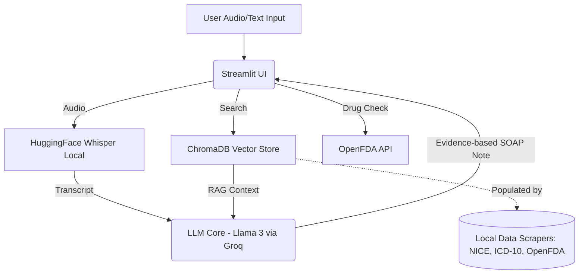

# MediMate: Medical Copilot
**One-line description:** A zero-cost, real-time medical copilot that generates evidence-based SOAP notes from doctor-patient conversations using RAG and local vector search.
**Problem Code:** E2 (Domain Copilot)  
**Segment:** Segment 5 — LLM Systems & Applied GenAI  
**Target Roles:** AI Product Engineer, AI Engineer, LLM Engineer
**Developer:** [Your Name]

## The Problem
Doctors spend 2+ hours a day on documentation. MediMate is a zero-cost, real-time medical copilot that listens to doctor-patient conversations and automatically produces structured SOAP notes, suggests ICD-10 codes, and flags potential drug interactions by referencing NICE clinical guidelines via RAG.

## Tech Stack
| Component | Choice | Why |
|---|---|---|
| **UI** | Streamlit | Rapid prototyping, completely free. |
| **Audio Processing** | Whisper (HuggingFace) | Runs locally, zero cost, high accuracy. |
| **LLM Core** | Groq (Llama 3) / LangChain | Blazing fast inference, free tier available. |
| **Vector DB (RAG)** | ChromaDB | Open-source, runs locally without external servers, fast. |
| **Embeddings** | sentence-transformers | `all-MiniLM-L6-v2` runs locally for free, very fast. |
| **Data Sources** | OpenFDA, NICE Guidelines | Public medical data APIs and scraped guidelines. |

## Architecture Diagram (C4 Level 1 Equivalent)

## Quickstart
1. Ensure Python 3.10+ is installed.
2. Run `pip install -r requirements.txt`.
3. Set your Groq API key (if using Groq) in a `.env` file or Streamlit secrets: `GROQ_API_KEY=your_key`.
4. Run `streamlit run app.py`.
