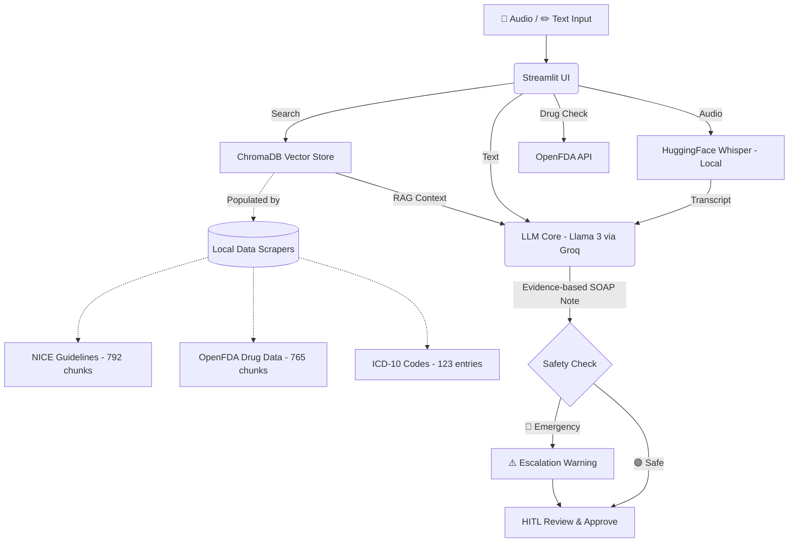

# MediMate: Medical Copilot 🩺

**A zero-cost, real-time medical copilot that generates evidence-based SOAP notes from doctor-patient conversations using RAG and local vector search.**

**Problem Code:** E2 (Domain Copilot)  
**Segment:** Segment 5 — LLM Systems & Applied GenAI  
**Target Roles:** AI Product Engineer, AI Engineer, LLM Engineer  

---

## 🎬 Demo

- **Live URL:** *(Deploy to Streamlit Cloud: `streamlit run app.py`)*
- **Loom Walkthrough:** *(Record a 5-min demo and paste the link here)*

---

## 📋 Problem Statement

Doctors spend 2+ hours a day on documentation. MediMate is a zero-cost, real-time medical copilot that listens to doctor-patient conversations and automatically produces structured SOAP notes, suggests ICD-10 codes, recommends diagnostic tests, and flags potential drug interactions — all by referencing NICE clinical guidelines via RAG.

**Key differentiator:** Entirely zero-cost. No paid APIs, no cloud databases, no GPU required. Runs on a standard laptop.

---

## 🏗️ Architecture



---

## 🛠️ Tech Stack

| Component | Choice | Why |
|---|---|---|
| **UI** | Streamlit | Rapid prototyping, zero cost, interactive widgets |
| **Audio Processing** | Whisper (HuggingFace) | Runs locally on CPU, zero cost, high accuracy |
| **LLM Core** | Groq (Llama 3 8B) | 500 tok/s inference, free tier, open model (privacy-ready) |
| **Orchestration** | LangChain | Prompt templates, chain composition, provider abstraction |
| **Vector DB (RAG)** | ChromaDB | Open-source, local-first, persistent, zero infrastructure |
| **Embeddings** | sentence-transformers | `all-MiniLM-L6-v2` — runs on CPU, 50ms/query |
| **Data Sources** | NICE, OpenFDA, ICD-10 | Public, authoritative, free clinical data |
| **Logging** | Python logging (structured) | Request tracing, timing, error tracking |
| **Testing** | pytest | 31 tests across 4 test files |

---

## 🚀 Quickstart

### Prerequisites
- Python 3.10+
- ~2GB disk space (for models and data)
- Internet connection (for initial data download and Groq API)

### Install
```bash
git clone https://github.com/Har-dik25/MediNote.git
cd MediNote
python -m venv venv

# Windows
.\venv\Scripts\Activate.ps1
# macOS/Linux
source venv/bin/activate

pip install -r requirements.txt
```

### Configure
Create a `.env` file in the project root:
```ini
GROQ_API_KEY=your_groq_api_key_here
```
Get a free API key at [console.groq.com](https://console.groq.com). The app also works in mock mode without a key.

### Setup Data (one-time, ~8 min)
```bash
python setup_data.py
```
This downloads NICE guidelines, OpenFDA drug data, generates ICD-10 codes, and builds the ChromaDB vector store.

### Run
```bash
python -m streamlit run app.py
```
Open `http://localhost:8501` in your browser.

### Test
```bash
python -m pytest tests/ -v
```

---

## 📂 Project Structure

```
MediMate/
├── app.py                  # Streamlit UI (main entry point)
├── llm_core.py             # LLM integration, SOAP generation, safety checks
├── rag_engine.py           # ChromaDB vector store, search functions
├── tools.py                # Drug interaction, ICD-10, test suggestion, guideline lookup
├── audio_processor.py      # Whisper audio transcription
├── data_processor.py       # Data chunking and processing
├── logger.py               # Structured logging module
├── setup_data.py           # One-command data setup
├── scrape_nice.py          # NICE guidelines scraper
├── scrape_drug_data.py     # OpenFDA drug data scraper
├── scrape_icd10.py         # ICD-10 code generator
├── requirements.txt        # Python dependencies
├── .env                    # API keys (not committed)
├── data/                   # Downloaded and processed data
│   ├── nice_guidelines/    # NICE guideline PDFs and text
│   ├── drug_reference/     # OpenFDA drug data
│   ├── icd10_codes/        # ICD-10 code data
│   └── chroma_db/          # ChromaDB persistent storage
├── tests/                  # Automated test suite
│   ├── test_tools.py       # Tool function tests
│   ├── test_llm_core.py    # LLM and safety tests
│   ├── test_rag_engine.py  # RAG search tests
│   └── test_integration.py # End-to-end pipeline tests
└── docs/                   # Documentation
    ├── adr/                # Architecture Decision Records
    │   ├── ADR-001-llm-provider.md
    │   ├── ADR-002-vector-store.md
    │   └── ADR-003-rag-data-sources.md
    ├── data.md             # Data sources documentation
    ├── test_report.md      # Test results summary
    ├── thinking_artifact.md # Deep-dive technical blog post
    ├── resume_bullets.md   # Project resume bullets
    └── mock_interview.md   # Interview Q&A preparation
```

---

## 📊 Data

See [`docs/data.md`](docs/data.md) for full documentation of data sources, licenses, schemas, and refresh instructions.

| Source | Documents | License |
|--------|-----------|---------|
| NICE Clinical Guidelines | 792 chunks (20 guidelines) | Open Government Licence v3.0 |
| OpenFDA Drug Reference | 765 chunks | Public Domain (US Gov) |
| ICD-10-CM Codes | 123 entries | Public Domain (CMS/WHO) |

---

## 📝 ADRs

See [`docs/adr/`](docs/adr/) for Architecture Decision Records:

1. [ADR-001: LLM Provider](docs/adr/ADR-001-llm-provider.md) — Why Groq + Llama 3 over OpenAI
2. [ADR-002: Vector Store](docs/adr/ADR-002-vector-store.md) — Why ChromaDB over Qdrant/Pinecone
3. [ADR-003: RAG Data Sources](docs/adr/ADR-003-rag-data-sources.md) — Why NICE + OpenFDA + ICD-10

---

## ⚠️ Known Limitations

- **Not for clinical use.** This is a prototype. AI-generated notes require physician review.
- **UK-centric guidelines.** NICE guidelines are UK-specific. Indian/US doctors would need local guidelines.
- **Shallow ICD-10 coverage.** 123 codes vs the full 70,000 in ICD-10-CM.
- **No EHR integration.** Notes are not connected to any electronic health record system.
- **General-purpose embeddings.** `all-MiniLM-L6-v2` is not trained on medical text.
- **Dense-only retrieval.** No BM25 keyword search — exact drug name matching could be improved.

---

## 🗺️ Roadmap (If I Had 2 More Weeks)

- [ ] **Domain-specific embeddings** — Replace with PubMedBERT or BioLord
- [ ] **Hybrid search** — Add BM25 alongside dense retrieval
- [ ] **Evaluation framework** — 50 curated transcripts with automated quality metrics
- [ ] **Streaming output** — Token-by-token SOAP note display via Groq streaming API
- [ ] **Deploy to Streamlit Cloud** — One-click public deployment
- [ ] **Audit logging** — Per-note provenance tracking for compliance

---

## 📄 License

This project is open-source under the [MIT License](LICENSE).

## 🙏 Acknowledgements

- [NICE](https://www.nice.org.uk/) for public clinical guidelines
- [OpenFDA](https://open.fda.gov/) for public drug data
- [Groq](https://groq.com/) for free LLM inference
- [ChromaDB](https://www.trychroma.com/) for the local vector store
- [HuggingFace](https://huggingface.co/) for Whisper and sentence-transformers
- [LangChain](https://www.langchain.com/) for LLM orchestration
