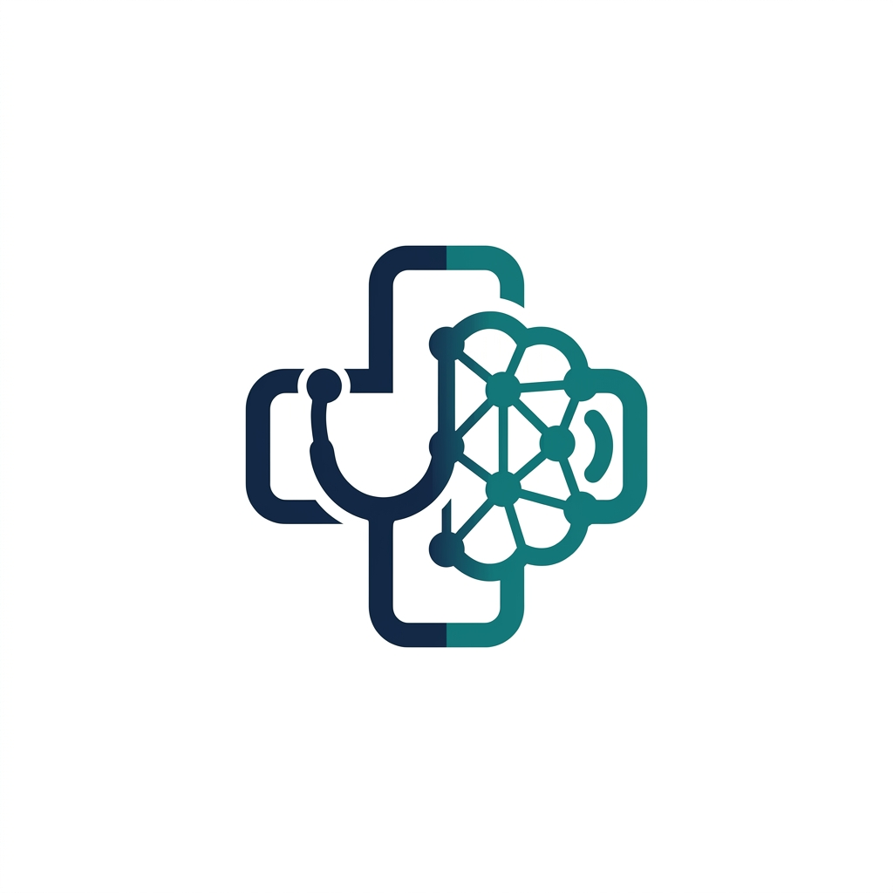

<div align="center">
  
  <h1>MediMate: Your AI Medical Copilot</h1>
  <p>
    <strong>A zero-cost, real-time clinical assistant that transforms doctor-patient conversations into evidence-based SOAP notes using RAG and local vector search.</strong>
  </p>
  
  <p>
    <a href="https://react.dev"></a>
    <a href="https://fastapi.tiangolo.com"></a>
    <a href="https://groq.com"></a>
    <a href="https://huggingface.co"></a>
    <a href="https://www.trychroma.com/"></a>
  </p>
</div>

---

## 📖 Overview

Medical professionals spend over 2 hours a day on documentation, leading to burnout and reduced patient face-time. **MediMate** is an open-source, zero-cost AI copilot designed to eliminate this administrative burden. It listens to doctor-patient interactions and automatically synthesizes structured **SOAP notes**, suggests appropriate **ICD-10 codes**, recommends diagnostic tests, and flags potential drug interactions. 

Crucially, MediMate relies on **Retrieval-Augmented Generation (RAG)** referencing authoritative global clinical guidelines, ensuring all outputs are evidence-based.

## ✨ Features

- 🎙️ **Real-time Transcription:** Powered by local HuggingFace Whisper models for privacy-preserving, accurate medical transcription.
- 📝 **Automated SOAP Notes:** Generates structured Subjective, Objective, Assessment, and Plan notes instantly using Llama 3 via Groq.
- 🌍 **Global Evidence-Based RAG:** Grounds recommendations using multi-region guidelines covering the **UK (NICE)**, **North America (CDC/USPSTF)**, **Europe (EMA)**, and **Global (WHO)**. You can configure your region in Settings.
- 🩺 **Patient Tracking & History:** Enforces patient linking to notes. Manage patient profiles, review historical encounters, and securely delete records.
- ⚕️ **Comprehensive Specialties:** Supports 25+ medical and surgical specialties to personalize note generation.
- ⚠️ **Safety & Interaction Checks:** Automatically cross-references prescribed medications against known OpenFDA drug interactions.

---

## 🏗️ Architecture

MediMate is designed to prioritize **data privacy, minimal latency, and zero infrastructure costs**. The architecture centers around a "local-first" hybrid approach:

1. **Frontend (React + Vite)**: A responsive, modern UI for managing patients, uploading/recording audio, and reviewing SOAP notes.
2. **Backend API (FastAPI)**: A high-performance Python backend managing API requests, data pipelines, and orchestration.
3. **Whisper Engine**: Transcribing patient audio in the cloud poses HIPAA/GDPR risks. By running HuggingFace's Whisper model locally (via CPU), we guarantee that raw audio never leaves the clinic's network.
4. **RAG Orchestrator (LangChain)**: Receives the raw transcript, extracts keywords, and queries the local vector database.
5. **ChromaDB**: A local-only vector store storing multi-regional clinical guidelines and drug interaction data.

## 🛠️ Technology Stack

| Component | Choice | Why |
| :--- | :--- | :--- |
| **Frontend Interface** | [React](https://react.dev) + [Vite](https://vitejs.dev/) | Snappy, component-based modern UI |
| **Backend Framework** | [FastAPI](https://fastapi.tiangolo.com) | Extremely fast Python API layer |
| **Audio Processing** | [Whisper](https://huggingface.co/) (Local) | Privacy-preserving, accurate, runs without GPU |
| **Large Language Model** | Llama 3 via [Groq](https://groq.com/) | Lightning-fast inference (800+ tokens/sec), cost-effective |
| **Orchestration** | [LangChain](https://www.langchain.com/) | Standardized interfaces for chaining LLM calls and retrievers |
| **Vector Database** | [ChromaDB](https://www.trychroma.com/) | Persistent local storage, no external dependency required |
| **Embeddings** | `all-MiniLM-L6-v2` | Fast, lightweight dense embedding model running locally |

---

## 🚀 Quickstart Guide

### Prerequisites
- Python 3.10+
- Node.js 18+
- At least 2GB of free disk space
- A free API key from [Groq](https://console.groq.com)

### Installation

1. **Clone the repository:**
   ```bash
   git clone https://github.com/Har-dik25/MediNote.git
   cd MediNote
   ```

2. **Backend Setup:**
   ```bash
   cd backend
   # Windows
   python -m venv venv
   .\venv\Scripts\Activate.ps1
   # macOS/Linux
   # python -m venv venv && source venv/bin/activate
   
   pip install -r requirements.txt
   ```
   Create a `.env` file in the `backend` directory and add your Groq API key:
   ```ini
   GROQ_API_KEY=your_groq_api_key_here
   ```

3. **Frontend Setup:**
   ```bash
   cd ../medimate-frontend
   npm install
   ```

### Running the Application

1. **Initialize the Knowledge Base (One-time setup):**
   ```bash
   cd backend
   python setup_data.py
   ```
   *This script fetches regional guidelines (NICE, CDC, EMA, WHO), OpenFDA data, and builds the local ChromaDB vector index.*

2. **Start the Backend:**
   ```bash
   cd backend
   uvicorn main:app --reload
   ```

3. **Start the Frontend:**
   In a new terminal window:
   ```bash
   cd medimate-frontend
   npm run dev
   ```
   *Navigate to `http://localhost:5173` in your web browser.*

### Running Tests
Ensure system stability by running the backend test suite:
```bash
cd backend
python -m pytest tests/ -v
```

---

## 🆕 Recent Updates

- **SOAP Generation Fix:** Resolved a critical bug where the "Generate SOAP note" button would fail silently on new encounters. The Patient Selection Modal was correctly re-scoped, ensuring seamless encounter-to-patient linking and reliable note generation.
- **Multi-Region RAG Capabilities:** Expanded the knowledge base to support a comprehensive multi-region RAG architecture. MediMate now actively queries and filters clinical guidelines from the **CDC (North America)**, **NICE (UK)**, **EMA (Europe)**, and **WHO (Global)**, allowing clinicians to generate region-specific evidence-based notes.

## 📂 Project Structure

```
MediNote/
├── backend/                # FastAPI backend, LLM integrations, RAG engines
│   ├── data/               # Downloaded guidelines and vector db (generated)
│   ├── tests/              # Automated pytest suite
│   ├── setup_data.py       # Knowledge base initialization and scrapers
│   └── main.py             # API entrypoint
├── medimate-frontend/      # React + Vite frontend application
│   ├── src/                # UI components and pages
│   └── package.json        # Frontend dependencies
├── docs/                   # Architectural decisions and data docs
└── README.md               # You are here
```

## 🗺️ Roadmap

1. **FHIR / HL7 Integration:** Exporting generated SOAP notes directly into standard EHR systems (Epic, Cerner).
2. **Local LLM Execution (Ollama):** Removing the Groq API dependency entirely by running a 4-bit quantized Llama 3 model directly on-device using Ollama.
3. **Multi-Speaker Diarization:** Accurately attributing transcribed text to "Doctor" or "Patient".

---

## ⚠️ Important Disclaimers

- **Not for Clinical Use:** MediMate is a prototype and proof-of-concept. All AI-generated outputs MUST be reviewed by a qualified healthcare professional.
- **General Embeddings:** The embedding model (`all-MiniLM-L6-v2`) is a general-purpose model, not specifically trained on clinical corpora.

## 🤝 Contributing

Contributions are welcome! If you'd like to improve MediMate, please fork the repository, make your changes, and submit a Pull Request.

## 📄 License

Distributed under the MIT License. See `LICENSE` for more information.

---
<div align="center">
  <i>Built with ❤️ to give doctors their time back.</i>
</div>
