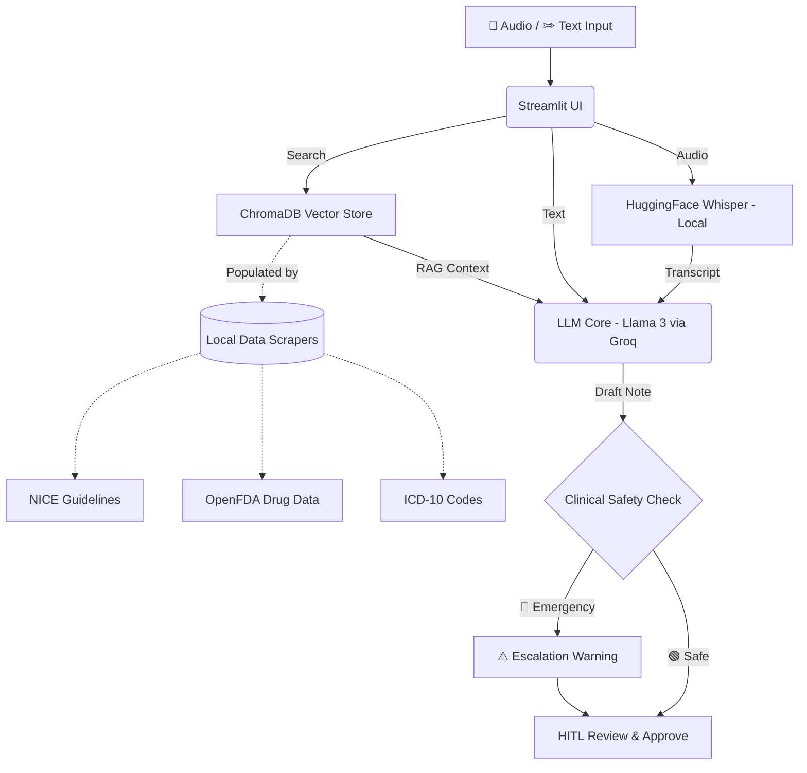

<div align="center">
  
  <h1>MediMate: Your AI Medical Copilot</h1>
  <p>
    <strong>A zero-cost, real-time clinical assistant that transforms doctor-patient conversations into evidence-based SOAP notes using RAG and local vector search.</strong>
  </p>
  
  <p>
    <a href="https://python.org"></a>
    <a href="https://streamlit.io"></a>
    <a href="https://groq.com"></a>
    <a href="https://huggingface.co"></a>
    <a href="https://www.trychroma.com/"></a>
  </p>
</div>

---

## 📖 Overview

Medical professionals spend over 2 hours a day on documentation, leading to burnout and reduced patient face-time. **MediMate** is an open-source, zero-cost AI copilot designed to eliminate this administrative burden. It listens to doctor-patient interactions and automatically synthesizes structured **SOAP notes**, suggests appropriate **ICD-10 codes**, recommends diagnostic tests, and flags potential drug interactions. 

Crucially, MediMate relies on **Retrieval-Augmented Generation (RAG)** referencing authoritative NICE clinical guidelines, ensuring all outputs are evidence-based. It runs entirely on local infrastructure or free-tier APIs, making it a zero-cost solution for practitioners.

## ✨ Features

- 🎙️ **Real-time Transcription:** Powered by local HuggingFace Whisper models for privacy-preserving, accurate medical transcription.
- 📝 **Automated SOAP Notes:** Generates structured Subjective, Objective, Assessment, and Plan notes instantly using Llama 3.
- 📚 **Evidence-Based RAG:** Grounds recommendations using 792 chunks of NICE Guidelines and OpenFDA drug data.
- ⚠️ **Safety & Interaction Checks:** Automatically cross-references prescribed medications against known OpenFDA drug interactions.
- 💻 **Zero-Cost & Local-First:** Designed to run on standard hardware without expensive API subscriptions or GPU requirements.

---

## 🏗️ Architecture

MediMate's architecture is designed for speed, accuracy, and cost-efficiency.



## 🛠️ Technology Stack

- **Frontend Interface:** [Streamlit](https://streamlit.io/)
- **Audio Processing:** [Whisper by HuggingFace](https://huggingface.co/) (Local CPU Inference)
- **Large Language Model:** Llama 3 8B via [Groq](https://groq.com/) for lightning-fast inference
- **Orchestration:** [LangChain](https://www.langchain.com/)
- **Vector Database:** [ChromaDB](https://www.trychroma.com/) (Persistent Local Storage)
- **Embeddings:** `all-MiniLM-L6-v2` via `sentence-transformers`

---

## 🚀 Quickstart Guide

### Prerequisites
- Python 3.10 or higher
- At least 2GB of free disk space
- A free API key from [Groq](https://console.groq.com)

### Installation

1. **Clone the repository:**
   ```bash
   git clone https://github.com/Har-dik25/MediNote.git
   cd MediNote
   ```

2. **Create and activate a virtual environment:**
   ```bash
   # Windows
   python -m venv venv
   .\venv\Scripts\Activate.ps1
   
   # macOS/Linux
   python -m venv venv
   source venv/bin/activate
   ```

3. **Install dependencies:**
   ```bash
   pip install -r requirements.txt
   ```

4. **Environment Configuration:**
   Create a `.env` file in the root directory and add your Groq API key:
   ```ini
   GROQ_API_KEY=your_groq_api_key_here
   ```

### Running the Application

1. **Initialize the Knowledge Base (One-time setup, ~8 mins):**
   ```bash
   python setup_data.py
   ```
   *This script fetches NICE guidelines, OpenFDA data, and builds the local ChromaDB vector index.*

2. **Launch the Copilot:**
   ```bash
   python -m streamlit run app.py
   ```
   *Navigate to `http://localhost:8501` in your web browser.*

### Running Tests
Ensure system stability by running the test suite:
```bash
python -m pytest tests/ -v
```

---

## 📂 Project Structure

```
MediMate/
├── app.py                  # Main Streamlit application
├── backend/                # Core logic, LLM integrations, RAG engines
├── docs/                   # Architectural decisions and data docs
├── data/                   # Downloaded guidelines and vector db (generated)
├── tests/                  # Automated pytest suite
├── setup_data.py           # Knowledge base initialization script
└── requirements.txt        # Dependency management
```

## ⚠️ Important Disclaimers

- **Not for Clinical Use:** MediMate is a prototype and proof-of-concept. All AI-generated outputs MUST be reviewed by a qualified healthcare professional.
- **Regional Guidelines:** The current vector database uses UK-centric NICE guidelines.
- **General Embeddings:** The embedding model (`all-MiniLM-L6-v2`) is a general-purpose model, not specifically trained on clinical corpora.

## 🤝 Contributing

Contributions are welcome! If you'd like to improve MediMate, please fork the repository, make your changes, and submit a Pull Request. For major changes, please open an issue first to discuss your proposed updates.

## 📄 License

Distributed under the MIT License. See `LICENSE` for more information.

---
<div align="center">
  <i>Built with ❤️ to give doctors their time back.</i>
</div>
