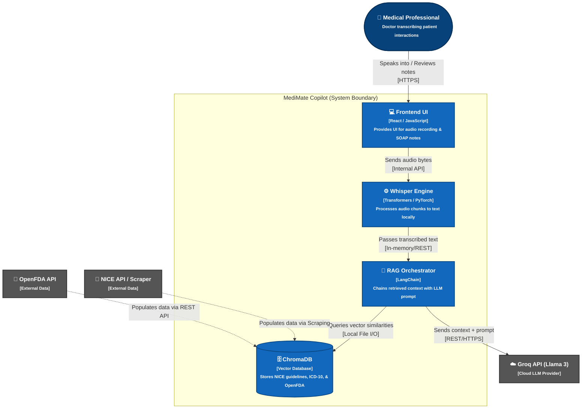

# MediMate Architecture

Below is the improved, high-visibility architecture diagram for MediMate. It uses Mermaid.js, which automatically renders directly in GitHub and most Markdown viewers!

```mermaid
flowchart TD
    %% Styling
    classDef person fill:#08427B,stroke:#052e56,stroke-width:2px,color:#fff,font-weight:bold,padding:10px
    classDef container fill:#1168BD,stroke:#0b4884,stroke-width:2px,color:#fff,font-weight:bold
    classDef external fill:#555555,stroke:#333333,stroke-width:2px,color:#fff,font-weight:bold
    classDef database fill:#1168BD,stroke:#0b4884,stroke-width:2px,color:#fff,font-weight:bold

    %% Nodes
    Doctor(["👤 Medical Professional<br/><span style='font-size:12px;font-weight:normal'>Doctor transcribing patient interactions</span>"]):::person

    subgraph System ["MediMate Copilot (System Boundary)"]
        direction TB
        UI["💻 Frontend UI<br/><span style='font-size:12px;font-weight:normal'>[React / JavaScript]</span><br/><span style='font-size:12px;font-weight:normal'>Provides UI for audio recording & SOAP notes</span>"]:::container
        
        Whisper["⚙️ Whisper Engine<br/><span style='font-size:12px;font-weight:normal'>[Transformers / PyTorch]</span><br/><span style='font-size:12px;font-weight:normal'>Processes audio chunks to text locally</span>"]:::container
        
        RAG["🧠 RAG Orchestrator<br/><span style='font-size:12px;font-weight:normal'>[LangChain]</span><br/><span style='font-size:12px;font-weight:normal'>Chains retrieved context with LLM prompt</span>"]:::container
        
        DB[("🗄️ ChromaDB<br/><span style='font-size:12px;font-weight:normal'>[Vector Database]</span><br/><span style='font-size:12px;font-weight:normal'>Stores NICE guidelines, ICD-10, & OpenFDA</span>")]:::database
    end

    Groq["☁️ Groq API (Llama 3)<br/><span style='font-size:12px;font-weight:normal'>[Cloud LLM Provider]</span>"]:::external
    NICE["🏥 NICE API / Scraper<br/><span style='font-size:12px;font-weight:normal'>[External Data]</span>"]:::external
    OpenFDA["💊 OpenFDA API<br/><span style='font-size:12px;font-weight:normal'>[External Data]</span>"]:::external

    %% Relationships
    Doctor -- "Speaks into / Reviews notes\n[HTTPS]" --> UI
    UI -- "Sends audio bytes\n[Internal API]" --> Whisper
    Whisper -- "Passes transcribed text\n[In-memory/REST]" --> RAG
    RAG -- "Queries vector similarities\n[Local File I/O]" --> DB
    RAG -- "Sends context + prompt\n[REST/HTTPS]" --> Groq
    
    NICE -. "Populates data via Scraping" .-> DB
    OpenFDA -. "Populates data via REST API" .-> DB
```
